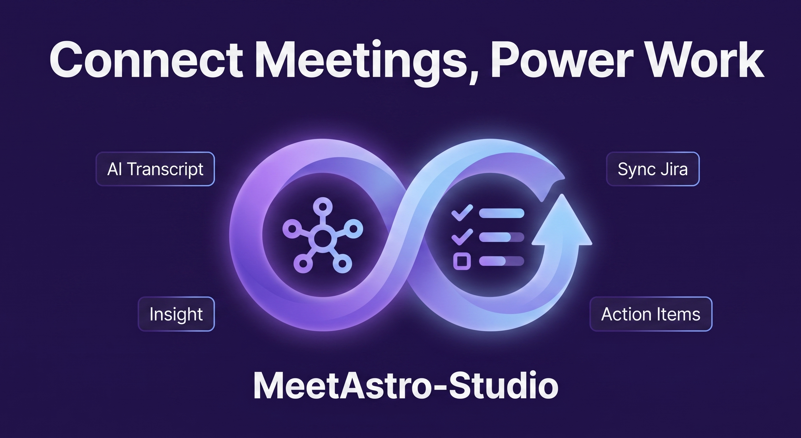

# AI Meeting Assistant

<p align="center">
  <strong>Turn meeting audio into reviewed Jira-ready action items.</strong>
</p>

<p align="center">
  
</p>

<p align="center">
  
  
  
  
  
  
  
</p>

AI Meeting Assistant is a desktop-first meeting productivity tool for converting meeting audio or video into structured minutes, transcript segments, and action items. The app records or uploads audio from an Electron client, transcribes it with OpenAI Whisper or WhisperLiveKit, analyzes it with GPT-4o, lets users review and edit the result, then exports or pushes approved work items to Jira as Epic → Task → Subtask.

Architecture: **Electron desktop app** + **FastAPI backend** + **Celery worker** + **Redis** + **Supabase database/auth**.

## Submission Deliverables

| Requirement | Artifact |
|---|---|
| Product / Project Name | **AI Meeting Assistant** |
| Product Description | [Product Spec](docs/product/spec.md) |
| Thumbnail | [Thumbnail Image](banner.png) |
| Architecture Diagram | [System Architecture Diagram](docs/diagrams/image/System%20Architecture_done.png) |
| Weekly Journal | [JOURNAL.md](JOURNAL.md) |
| Worklog | [WORKLOG.md](WORKLOG.md) |
| Technical Architecture | [docs/technical/architecture.md](docs/technical/architecture.md) |
| Documentation Index | [docs/INDEX.md](docs/INDEX.md) |
| Evaluation Plan | [Test Plan](docs/evaluation/test-plan.md), [Evaluation Metrics](docs/evaluation/eval-metrics.md) |

## Product Highlights

- **Desktop recording and upload**: capture system audio + microphone or upload audio/video files from the Electron app.
- **AI transcription**: normalize audio and transcribe with OpenAI Whisper API, with optional WhisperLiveKit diarization/streaming support.
- **Structured analysis**: extract meeting summaries, decisions, and Jira-ready Epic/Task/Subtask action items with GPT-4o JSON output.
- **Human review loop**: approve, edit, reject, and re-analyze transcript/action items before exporting or syncing to Jira.
- **Supabase-backed workspace**: use Supabase Auth and database tables as the canonical runtime for users, meetings, transcripts, analysis, and Jira metadata.
- **Async processing pipeline**: delegate long-running transcription, analysis, Jira push, and cleanup jobs to Celery workers through Redis.

## Workflow

```text
Electron app
  -> Supabase SDK for auth and direct data views
  -> FastAPI /api/v1 for upload, jobs, AI processing, Jira push
      -> Redis queue
      -> Celery worker
          -> OpenAI / WhisperLiveKit / Jira
          -> Supabase database
```

## Project Structure

```text
A20-App-089/
├── electron-app/                # Electron + React + TypeScript desktop app
├── src/                         # FastAPI backend and worker code
│   ├── api/                     # Routers + schemas
│   ├── workers/                 # Celery tasks
│   ├── services/                # Business logic
│   ├── providers/               # OpenAI / transcription integrations
│   ├── modules/                 # Jira, audio recorder, exporter
│   ├── db/                      # Supabase client + CRUD helpers
│   └── prompts/                 # LLM prompt templates
├── tests/                       # pytest test files
├── docs/                        # Product, technical, evaluation docs
├── docker-compose.yml           # Redis + API + worker for backend deploy
├── Dockerfile                   # Backend API/worker image
├── pyproject.toml               # Python package config
└── .env.example                 # Backend environment template
```

## Quick Start

### Prerequisites

- Python 3.11+ for backend
- Node.js 20+ for Electron app
- Docker Desktop with Linux engine enabled for backend deploy
- Supabase project with app tables configured
- `uv` or `pip`

### 1. Backend setup

```bash
python -m venv .venv
.\.venv\Scripts\Activate.ps1
python -m pip install -e ".[all]"
```

Or with `uv`:

```bash
uv venv
.\.venv\Scripts\Activate.ps1
uv pip install -e ".[all]"
```

### 2. Configure backend environment

```bash
cp .env.example .env
```

Fill in at least:

- `SUPABASE_URL`
- `SUPABASE_SERVICE_ROLE_KEY`
- `OPENAI_API_KEY`
- `APP_SECRET_KEY`

Optional:

- `JIRA_*` variables for Jira integration
- `WHISPER_LIVEKIT_URL` for self-hosted diarization/streaming

### 3. Start backend with Docker

```bash
docker compose up --build
```

This starts:

- **Redis** on the internal Docker network
- **FastAPI** on container port `8000`
- **Celery Worker** using Redis broker/result backend

The API health endpoint is `/api/v1/health`.

### 4. Start Electron app

```bash
cd electron-app
npm install
npm run dev
```

For a production desktop build:

```bash
cd electron-app
npm run build
```

## Local Backend Dev Mode

```bash
# Start Redis only
docker compose up redis -d

# Run API with hot reload
uvicorn src.api.main:app --reload --port 8000

# Run Celery worker in another terminal
celery -A src.workers.celery_app worker -Q default --loglevel=info
```

## Commands

| Command | Description |
|---------|-------------|
| `uv pip install -e ".[server]"` | Install backend dependencies |
| `uv pip install -e ".[dev]"` | Install dev tools |
| `uv pip install -e ".[all]"` | Install backend + dev dependencies |
| `pytest tests/ -v` | Run tests |
| `flake8 . --max-line-length=100` | Lint Python code |
| `mypy . --ignore-missing-imports` | Type check Python code |
| `cd electron-app && npm run typecheck` | Type check Electron app |
| `cd electron-app && npm run build` | Build Electron desktop app |

## Current MVP Scope

- Electron desktop app for auth, recording/upload, transcript review, action-item review, Jira settings, and meeting history.
- FastAPI backend with Celery/Redis jobs for transcription, analysis, Jira push, website runtime, and Windows EXE download metadata.
- Supabase is the canonical database/auth runtime; local PostgreSQL/Alembic/Flet paths are legacy/prototype context only.
- Windows distribution target is `MeetAstro-Setup-*.exe` published through GitHub Releases or mounted in `APP_DOWNLOADS_DIR`.

Known limitations before production:

- Jira assignee account mapping, advanced export templates, usage billing, and richer collaboration features are backlog items.
- Production deployment should restrict `CORS_ORIGINS` and rotate any credentials that were ever shared in logs, screenshots, or committed files.
- `.env` is local-only and must never be committed; use `.env.example` for placeholders.

Local verification before submit:

- `python -m pytest tests/test_website_runtime.py -v`
- `pytest tests/ -v`
- `cd electron-app && npm run typecheck`
- `git status --short` to confirm no secrets, `node_modules`, caches, or release artifacts are staged.

## Documentation

| Document | Purpose |
|----------|---------|
| [Documentation Index](docs/INDEX.md) | Full documentation map |
| [Product Spec](docs/product/spec.md) | Product vision, user stories, metrics, failure modes |
| [AI Product Canvas](docs/product/canvas.md) | Value, trust, and feasibility canvas |
| [Technical Architecture](docs/technical/architecture.md) | System architecture and module map |
| [API Reference](docs/technical/api-reference.md) | REST endpoints and schemas |
| [Supabase Schema](docs/technical/supabase-schema.md) | Supabase Auth ownership and RLS |
| [Audio Processing](docs/technical/workflows/audio-processing.md) | Audio ingestion, transcription, diarization |
| [LLM Analysis](docs/technical/workflows/llm-analysis.md) | GPT-4o extraction workflow |
| [Jira Upload Flow](docs/technical/workflows/jira-upload-flow.md) | Jira Epic/Task/Subtask integration |
| [Weekly Journal](JOURNAL.md) | Weekly development reflection |
| [Worklog](WORKLOG.md) | Technical decisions and task assignment |

## License

This project is for educational purposes (VinUni A20 - AI Thuc Chien 2026).
